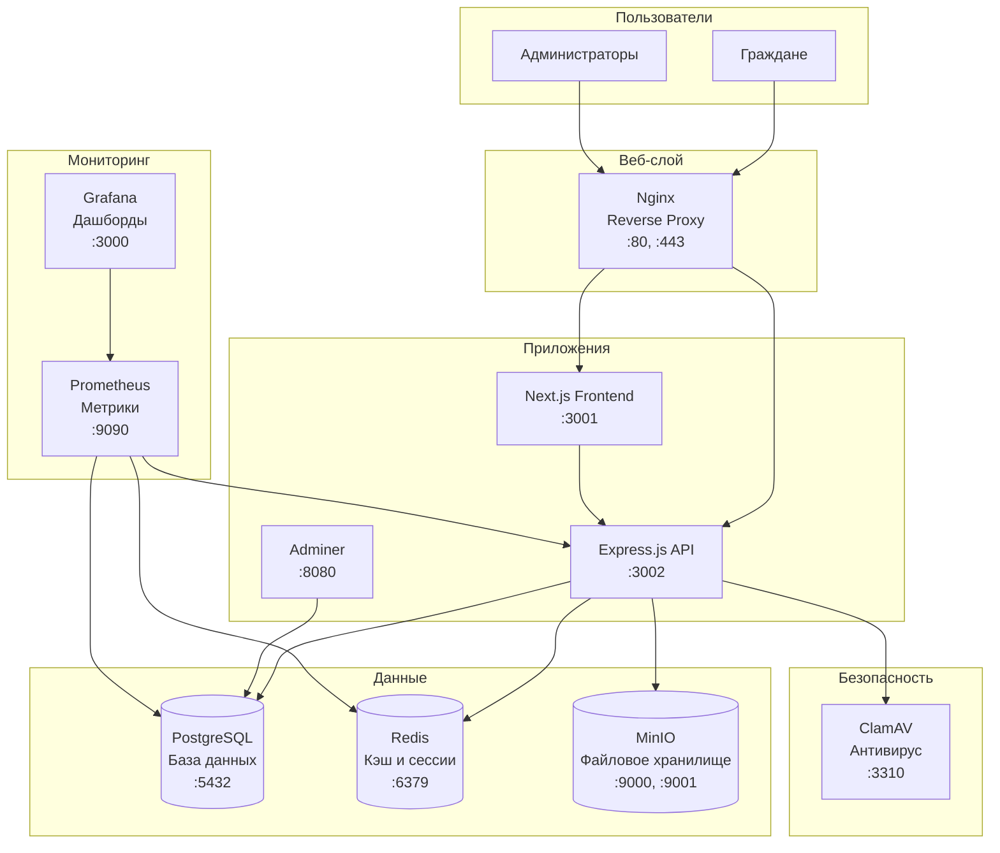

# 🐳 Подробное руководство по Docker инфраструктуре

## 🚀 Портативность проекта

**Проект полностью портативный!** Все данные хранятся в папке `./data/` внутри проекта.

### Преимущества портативной архитектуры:
- ✅ **Полная автономность** - нет зависимости от системных путей
- ✅ **Легкое развертывание** - скопировал папку и запустил
- ✅ **Изоляция данных** - каждый проект имеет свои данные
- ✅ **Простое резервное копирование** - архивируй одну папку
- ✅ **Миграция без проблем** - работает на любой системе с Docker

### Структура данных:
```
./data/
├── postgres/     # База данных PostgreSQL
├── redis/        # Кэш и сессии Redis
├── minio/        # Файловое хранилище MinIO
├── clamav/       # Антивирусные базы ClamAV
├── prometheus/   # Метрики Prometheus
└── grafana/      # Дашборды Grafana
```

## Обзор архитектуры

Проект использует микросервисную архитектуру с 8 основными контейнерами, каждый из которых выполняет специфическую роль в общей экосистеме сайта департамента.



## 📋 Детальное описание контейнеров

### 1. 🗄️ PostgreSQL - Основная база данных

**Назначение**: Хранение всех структурированных данных сайта

**Образ**: `postgres:15-alpine`
**Порты**: `5432:5432`
**Ресурсы**: ~200MB RAM, 1-5GB диск

#### Что хранит:
- **Пользователи и роли** - администраторы, редакторы, модераторы
- **Контент** - новости, страницы, документы, комментарии
- **Структура департамента** - подразделения, сотрудники, контакты
- **Обращения граждан** - заявки, статусы, ответы
- **Системные данные** - настройки, логи, метрики

#### Конфигурация:
```yaml
environment:
  POSTGRES_DB: econom32_new          # Имя базы данных
  POSTGRES_USER: econom32_user       # Пользователь БД
  POSTGRES_PASSWORD: econom32_password # Пароль (ИЗМЕНИТЬ в продакшене!)
  POSTGRES_INITDB_ARGS: "--encoding=UTF-8 --locale=C" # Кодировка UTF-8
```

#### Volumes:
- `postgres_data:/var/lib/postgresql/data` - Постоянное хранение данных
- `./docker/postgres/init:/docker-entrypoint-initdb.d` - Скрипты инициализации

#### Безопасность:
- ⚠️ **КРИТИЧНО**: Изменить пароль в продакшене
- ⚠️ **КРИТИЧНО**: Настроить SSL соединения
- ⚠️ **КРИТИЧНО**: Ограничить доступ только с backend контейнера

---

### 2. 🚀 Redis - Кэш и сессии

**Назначение**: Высокоскоростное кэширование и хранение сессий

**Образ**: `redis:7-alpine`
**Порты**: `6379:6379`
**Ресурсы**: ~50MB RAM, 100MB диск

#### Что кэширует:
- **API ответы** - результаты запросов к базе данных
- **Сессии пользователей** - JWT токены, состояние авторизации
- **Статические данные** - структура меню, настройки сайта
- **Счетчики** - просмотры новостей, статистика посещений
- **Временные данные** - капча, одноразовые токены

#### Конфигурация:
```yaml
command: redis-server --appendonly yes  # Включает персистентность данных
volumes:
  - redis_data:/data                     # Сохранение данных при перезапуске
```

#### Преимущества:
- **Скорость**: В 10-100 раз быстрее чем PostgreSQL для простых запросов
- **Масштабируемость**: Легко добавить Redis Cluster при росте нагрузки
- **Надежность**: AOF персистентность предотвращает потерю данных

---

### 3. 💾 MinIO - Файловое хранилище

**Назначение**: S3-совместимое хранилище для всех медиафайлов

**Образ**: `minio/minio:latest`
**Порты**: `9000:9000` (API), `9001:9001` (Web UI)
**Ресурсы**: ~100MB RAM, неограниченный диск

#### Что хранит:
- **Изображения** - фотографии новостей, сотрудников, баннеры
- **Документы** - PDF, DOC, XLS файлы для скачивания
- **Медиа** - видео, аудио файлы для встраивания
- **Аватары** - фотографии пользователей и администраторов
- **Резервные копии** - бэкапы базы данных и конфигураций

#### Конфигурация:
```yaml
environment:
  MINIO_ROOT_USER: econom32_minio           # Логин (ИЗМЕНИТЬ!)
  MINIO_ROOT_PASSWORD: econom32_minio_password # Пароль (ИЗМЕНИТЬ!)
command: server /data --console-address ":9001"
```

#### Buckets (корзины):
- `public` - Публичные файлы (изображения новостей)
- `private` - Приватные файлы (документы обращений)
- `backups` - Резервные копии
- `temp` - Временные файлы для обработки

#### Преимущества:
- **S3 совместимость** - можно легко мигрировать в AWS/Yandex Cloud
- **Веб-интерфейс** - удобное управление файлами через браузер
- **Масштабируемость** - поддержка кластеризации и репликации

---

### 4. 🛡️ ClamAV - Антивирусная защита

**Назначение**: Сканирование всех загружаемых файлов на вирусы

**Образ**: `clamav/clamav:latest`
**Порты**: `3310:3310`
**Ресурсы**: ~500MB RAM, 2GB диск (база вирусов)

#### Функции:
- **Сканирование файлов** - проверка всех загружаемых документов
- **Обновление баз** - автоматическое обновление антивирусных сигнатур
- **Карантин** - изоляция зараженных файлов
- **Логирование** - детальные отчеты о проверках

#### Конфигурация:
```yaml
environment:
  CLAMAV_NO_FRESHCLAMD: "false"  # Включает автообновление баз
volumes:
  - clamav_data:/var/lib/clamav   # Хранение антивирусных баз
```

#### Интеграция:
- Backend API автоматически отправляет все файлы на проверку
- Зараженные файлы блокируются и удаляются
- Администраторы получают уведомления о найденных угрозах

#### ⚠️ Важно:
- Первый запуск может занять 10-15 минут (загрузка баз)
- Требует стабильного интернет-соединения для обновлений
- В продакшене рекомендуется увеличить RAM до 1GB

---

### 5. 🌐 Nginx - Веб-сервер и прокси

**Назначение**: Обратный прокси, балансировщик нагрузки, SSL терминация

**Образ**: `nginx:alpine`
**Порты**: `80:80` (HTTP), `443:443` (HTTPS)
**Ресурсы**: ~20MB RAM, минимальный диск

#### Функции:
- **Reverse Proxy** - перенаправление запросов к backend/frontend
- **SSL терминация** - обработка HTTPS соединений
- **Статические файлы** - быстрая отдача CSS, JS, изображений
- **Кэширование** - кэш статического контента
- **Сжатие** - Gzip/Brotli компрессия для ускорения загрузки

#### Конфигурация:
```yaml
volumes:
  - ./docker/nginx/nginx.conf:/etc/nginx/nginx.conf:ro
  - ./docker/nginx/conf.d:/etc/nginx/conf.d:ro
  - ./docker/ssl:/etc/nginx/ssl:ro
```

#### Маршрутизация:
- `/` → Frontend (Next.js)
- `/api/` → Backend (Express.js)
- `/admin/` → Admin Panel
- `/files/` → MinIO (статические файлы)

#### ⚠️ Требует настройки:
- SSL сертификаты для HTTPS
- WAF правила для защиты от атак
- Rate limiting для защиты от DDoS

---

### 6. 🔍 Adminer - Управление базой данных

**Назначение**: Веб-интерфейс для администрирования PostgreSQL

**Образ**: `adminer:latest`
**Порты**: `8080:8080`
**Ресурсы**: ~30MB RAM, минимальный диск

#### Возможности:
- **Просмотр данных** - таблицы, индексы, связи
- **Выполнение SQL** - запросы, создание таблиц
- **Импорт/экспорт** - резервное копирование данных
- **Мониторинг** - активные соединения, производительность

#### Доступ:
- URL: http://localhost:8080
- Сервер: `postgres`
- Пользователь: `econom32_user`
- Пароль: `econom32_password`

#### ⚠️ Безопасность:
- **НЕ ИСПОЛЬЗОВАТЬ в продакшене** без дополнительной защиты
- Рекомендуется VPN доступ или IP ограничения
- Альтернатива: pgAdmin4 с более продвинутой безопасностью

---

### 7. 📊 Prometheus - Сбор метрик

**Назначение**: Мониторинг производительности и состояния системы

**Образ**: `prom/prometheus:latest`
**Порты**: `9090:9090`
**Ресурсы**: ~100MB RAM, 1-10GB диск (зависит от retention)

#### Метрики:
- **Системные** - CPU, RAM, диск, сеть
- **Приложения** - время ответа API, ошибки, throughput
- **База данных** - количество соединений, медленные запросы
- **Безопасность** - неудачные входы, заблокированные IP
- **Бизнес** - посетители, обращения, популярные страницы

#### Конфигурация:
```yaml
volumes:
  - ./docker/prometheus/prometheus.yml:/etc/prometheus/prometheus.yml:ro
  - prometheus_data:/prometheus
```

#### Targets (цели мониторинга):
- Backend API: `http://backend:3002/metrics`
- PostgreSQL: через postgres_exporter
- Redis: через redis_exporter
- Node.js: через node_exporter

---

### 8. 📈 Grafana - Визуализация метрик

**Назначение**: Дашборды и алерты на основе данных Prometheus

**Образ**: `grafana/grafana:latest`
**Порты**: `3000:3000`
**Ресурсы**: ~150MB RAM, 500MB диск

#### Дашборды:
- **Обзор системы** - общее состояние всех сервисов
- **Производительность** - время ответа, throughput, ошибки
- **Безопасность** - атаки, блокировки, аудит
- **Бизнес-метрики** - посетители, конверсии, популярный контент

#### Конфигурация:
```yaml
environment:
  GF_SECURITY_ADMIN_PASSWORD: admin123  # ИЗМЕНИТЬ в продакшене!
  GF_USERS_ALLOW_SIGN_UP: "false"      # Запрет регистрации
volumes:
  - grafana_data:/var/lib/grafana
  - ./docker/grafana/provisioning:/etc/grafana/provisioning
```

#### Алерты:
- **Критические** - сайт недоступен, атака, переполнение диска
- **Предупреждения** - высокая нагрузка, медленные запросы
- **Информационные** - новые пользователи, популярные страницы

---

## 🚀 Команды управления

### Базовые операции
```bash
# Запуск всех сервисов
docker-compose up -d

# Просмотр статуса
docker-compose ps

# Просмотр логов
docker-compose logs -f [service_name]

# Остановка всех сервисов
docker-compose down

# Остановка с удалением данных (ОСТОРОЖНО!)
docker-compose down -v
```

### Управление отдельными сервисами
```bash
# Перезапуск конкретного сервиса
docker-compose restart postgres

# Обновление образа
docker-compose pull postgres
docker-compose up -d postgres

# Масштабирование (для stateless сервисов)
docker-compose up -d --scale backend=3
```

### Мониторинг и отладка
```bash
# Подключение к контейнеру
docker-compose exec postgres psql -U econom32_user -d econom32_new

# Просмотр ресурсов
docker stats

# Очистка неиспользуемых данных
docker system prune -a
```

## 🔧 Настройка для продакшена

### 1. Безопасность
```yaml
# Изменить все пароли по умолчанию
POSTGRES_PASSWORD: "STRONG_RANDOM_PASSWORD_HERE"
MINIO_ROOT_PASSWORD: "ANOTHER_STRONG_PASSWORD"
GF_SECURITY_ADMIN_PASSWORD: "GRAFANA_ADMIN_PASSWORD"

# Ограничить доступ к портам
# Убрать expose портов для внутренних сервисов
# Оставить только 80, 443 для Nginx
```

### 2. Производительность
```yaml
# Увеличить ресурсы для PostgreSQL
deploy:
  resources:
    limits:
      memory: 2G
      cpus: '2'

# Настроить Redis для продакшена
command: redis-server --maxmemory 512mb --maxmemory-policy allkeys-lru
```

### 3. Мониторинг
```yaml
# Добавить health checks
healthcheck:
  test: ["CMD", "pg_isready", "-U", "econom32_user"]
  interval: 30s
  timeout: 10s
  retries: 3
```

## 📊 Мониторинг состояния

### Проверка работоспособности
```bash
# Проверка всех сервисов
curl http://localhost:3002/health

# Проверка базы данных
docker-compose exec postgres pg_isready

# Проверка Redis
docker-compose exec redis redis-cli ping

# Проверка MinIO
curl http://localhost:9000/minio/health/live
```

### Важные метрики
- **PostgreSQL**: Количество соединений, размер БД, медленные запросы
- **Redis**: Использование памяти, hit ratio, количество ключей
- **MinIO**: Использование диска, количество объектов, throughput
- **ClamAV**: Статус обновления баз, количество проверенных файлов

## ⚠️ Критические проблемы и решения

### 1. ClamAV не запускается
```bash
# Увеличить память для контейнера
docker-compose up -d --scale clamav=0
docker run --rm -m 1g clamav/clamav:latest
```

### 2. PostgreSQL медленно работает
```bash
# Оптимизация конфигурации
echo "shared_preload_libraries = 'pg_stat_statements'" >> postgresql.conf
echo "max_connections = 200" >> postgresql.conf
```

### 3. MinIO недоступен
```bash
# Проверка прав доступа к volume
sudo chown -R 1001:1001 ./minio_data
```

### 4. Prometheus не собирает метрики
```bash
# Проверка конфигурации
docker-compose exec prometheus promtool check config /etc/prometheus/prometheus.yml
```

## 🎯 Рекомендации по оптимизации

### Для разработки:
- Использовать `docker-compose.override.yml` для локальных настроек
- Включить hot reload для frontend/backend
- Отключить ресурсоемкие сервисы (Prometheus, Grafana) при необходимости

### Для продакшена:
- Использовать Docker Swarm или Kubernetes для оркестрации
- Настроить автоматическое резервное копирование
- Внедрить централизованное логирование (ELK Stack)
- Настроить мониторинг и алерты

## 🚀 Портативность и развертывание

### Быстрое развертывание на новом сервере

```bash
# 1. Скопировать проект
scp -r ./econom32_v1 user@server:/opt/

# 2. На новом сервере
cd /opt/econom32_v1

# 3. Запустить автоматическую настройку
./scripts/dev-setup.sh

# 4. Проверить статус
docker-compose ps
```

### Резервное копирование данных

```bash
# Создать полный бэкап
tar -czf backup-$(date +%Y%m%d-%H%M).tar.gz data/

# Бэкап только базы данных
docker-compose exec postgres pg_dump -U econom32_user econom32_new > backup-db.sql

# Бэкап файлов MinIO
tar -czf backup-files.tar.gz data/minio/
```

### Восстановление из бэкапа

```bash
# 1. Остановить контейнеры
docker-compose down

# 2. Восстановить данные
tar -xzf backup-YYYYMMDD-HHMM.tar.gz

# 3. Запустить контейнеры
docker-compose up -d

# 4. Восстановить базу данных (если нужно)
docker-compose exec -T postgres psql -U econom32_user econom32_new < backup-db.sql
```

### Миграция между окружениями

```bash
# Development → Staging
rsync -av --exclude='node_modules' ./econom32_v1/ staging:/opt/econom32_v1/

# Staging → Production
rsync -av --exclude='data/postgres' ./econom32_v1/ production:/opt/econom32_v1/
```

### Мониторинг размера данных

```bash
# Размер каждого сервиса
du -sh data/*

# Общий размер проекта
du -sh .

# Очистка логов Docker
docker system prune -f
```

### Автоматизация с помощью Makefile

```bash
# Быстрый старт
make start

# Полная очистка и перезапуск
make clean && make start

# Создание бэкапа
make backup

# Просмотр логов
make logs
```

---

**Заключение**: Данная портативная Docker-инфраструктура обеспечивает полнофункциональную работу современного государственного сайта с высокими требованиями к безопасности, производительности и надежности. Проект можно легко развернуть на любом сервере с Docker, все данные хранятся локально в проекте, что обеспечивает максимальную портативность и простоту управления.