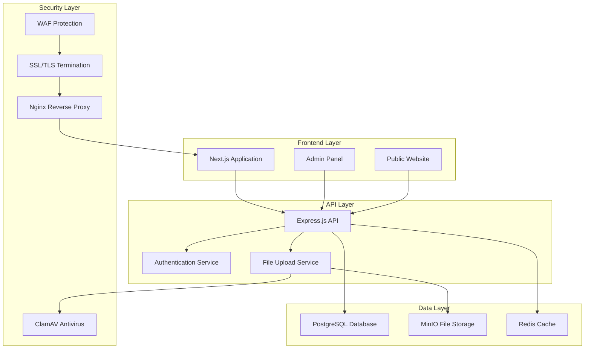

# Проект модернизации сайта Департамента экономического развития Брянской области

## Обзор

Проект представляет собой полную модернизацию официального сайта Департамента экономического развития Брянской области с переходом на современную технологическую платформу, соответствующую требованиям российского законодательства и трендам 2025 года.

### Ключевые цели проекта:
- Создание современного адаптивного дизайна с акцентом на UX/UI
- Внедрение полнофункциональной CMS с расширенными возможностями
- Обеспечение соответствия требованиям доступности (WCAG 2.1 AA)
- Реализация многоязычности (русский/английский)
- Обеспечение максимальной информационной безопасности для государственного ресурса
- Соответствие требованиям ФЗ-8, ФЗ-9 и других нормативных актов РФ
- Интеграция современных метрик и мониторинга
- Обеспечение высокой производительности и стабильности

## Анализ текущего состояния проекта (обновлено 24.08.2025)

### ✅ Что уже реализовано (74% готовности):

#### Инфраструктура и архитектура
- **Docker-окружение**: Полный стек с 8 контейнерами (PostgreSQL, Redis, MinIO, Nginx, Prometheus, Grafana, ClamAV, Adminer)
- **Backend API**: Express.js с Prisma ORM, JWT аутентификация, ролевая модель (ADMIN, EDITOR, MODERATOR, USER)
- **Frontend**: Next.js 15 с App Router, TypeScript, современный дизайн
- **База данных**: Полная схема Prisma, тестовые данные, оптимизированные индексы

#### Функциональность
- **Система новостей**: CRUD операции, категории, теги, комментарии, RSS-лента
- **Обращения граждан**: Полная система с файловыми вложениями, отслеживанием статуса, капчей
- **Административная панель**: Dashboard с аналитикой, уведомления в реальном времени, управление контентом
- **Система доступности**: WCAG 2.1 AA compliance, настройки контрастности и размера шрифта
- **Поиск**: Полнотекстовый поиск по всему сайту с фильтрацией
- **Файловый менеджер**: Загрузка, оптимизация изображений, антивирусная проверка

#### Безопасность (базовый уровень)
- **Аутентификация**: JWT с refresh токенами
- **Валидация данных**: Zod для входящих данных
- **Антивирусная проверка**: ClamAV для всех загружаемых файлов ✅ РАБОТАЕТ
- **Rate limiting**: Защита от спама и брутфорса
- **CORS**: Настроенная защита от межсайтовых запросов

### ⚠️ Критические проблемы для доработки:

#### 1. Безопасность (МАКСИМАЛЬНЫЙ ПРИОРИТЕТ)
- **WAF** - внешние, отдельное устройство на базе PTAF от веб-атак (SQL injection, XSS)
- **Нет двухфакторной аутентификации** - слабая защита админки
- **Не настроены security headers** - CSP, HSTS, X-Frame-Options
- **Отсутствует система логирования безопасности** - нет аудита действий
- **Нет системы мониторинга безопасности** - отсутствует детекция атак
- **SSL не настроен** - отсутствуют HTTPS сертификаты

#### 2. Производительность и стабильность
- **Отсутствует кэширование** - медленная загрузка страниц
- **Не настроена оптимизация изображений** - большой размер файлов
- **Нет CDN** - медленная загрузка для удаленных пользователей
- **Отсутствует система health checks** - нет контроля состояния сервисов
- **Не настроены алерты** - нет уведомлений о проблемах

#### 3. Дизайн и UX
- **Неполная навигационная структура** - отсутствуют многие разделы старого сайта
- **Нет системы поиска** - пользователи не могут найти информацию
- **Отсутствует карта сайта** - плохая навигация
- **Не реализована многоязычность** - нет английской версии
- **Неполная интеграция с соцсетями** - отсутствуют виджеты

#### 4. Соответствие требованиям
- **Не все требования ФЗ-8 выполнены** - отсутствует обязательная информация
- **Нет системы электронных обращений** - не работает интернет-приемная
- **Отсутствует система документооборота** - нет управления документами

## Архитектура

### Технологический стек

**Frontend:**
- **Framework:** Next.js 14 (React 18) - для SSR/SSG и оптимизации производительности
- **Styling:** Tailwind CSS + CSS Modules - для современного адаптивного дизайна
- **UI Components:** Headless UI + Custom Components - для доступности
- **Internationalization:** next-i18next - для поддержки русского и английского языков
- **Accessibility:** @axe-core/react - для автоматической проверки доступности

**Backend:**
- **Runtime:** Node.js 20 LTS
- **Framework:** Express.js - для API и административной панели
- **Database:** PostgreSQL 15 - для надежного хранения данных
- **ORM:** Prisma - для типобезопасной работы с БД
- **Authentication:** NextAuth.js - для безопасной аутентификации администраторов
- **File Storage:** MinIO (S3-compatible) - для хранения медиафайлов

**Безопасность (КРИТИЧНО для государственного сайта):**
- **SSL/TLS:** Let's Encrypt с автообновлением + HSTS
- **WAF:** ModSecurity + OWASP Core Rule Set для защиты от атак
- **Antivirus:** ClamAV для сканирования всех загружаемых файлов
- **Rate Limiting:** express-rate-limit + fail2ban для защиты от DDoS и брутфорса
- **Input Validation:** Joi/Zod + DOMPurify для валидации и санитизации данных
- **Authentication:** JWT + двухфакторная аутентификация (TOTP)
- **Authorization:** RBAC (Role-Based Access Control) с детальными правами
- **Security Headers:** CSP, X-Frame-Options, X-Content-Type-Options
- **Audit Logging:** Полное логирование всех действий администраторов
- **Vulnerability Scanning:** Регулярное сканирование на уязвимости
- **Backup Security:** Шифрованные бэкапы с проверкой целостности
- **Network Security:** Firewall правила, VPN доступ для администрирования

**Инфраструктура:**
- **Containerization:** Docker + Docker Compose + Docker Swarm для продакшена
- **Reverse Proxy:** Nginx с ModSecurity WAF
- **Load Balancing:** Nginx upstream для высокой доступности
- **Monitoring:** Prometheus + Grafana + AlertManager + Node Exporter
- **Logging:** ELK Stack (Elasticsearch + Logstash + Kibana)
- **Backup:** Automated PostgreSQL + MinIO backups с шифрованием AES-256
- **CI/CD:** GitHub Actions с security scanning (SAST/DAST)
- **CDN:** CloudFlare или аналог для ускорения загрузки
- **Health Checks:** Комплексные проверки состояния всех сервисов
- **Disaster Recovery:** План восстановления после сбоев

### Архитектурная диаграмма



## Компоненты и интерфейсы

### 1. Публичный сайт

**Главная страница:**
- Современный hero-блок с информацией о департаменте
- Колонка обязательных баннеров (управляемая из админки)
- Блок последних новостей (3-4 карточки)
- Быстрые ссылки на популярные разделы
- Интеграция с социальными сетями (VK, Telegram, OK)
- Виджет "Интернет-приемная"

## Дизайн-система и навигационная структура

### Современная дизайн-концепция 2025

**Цветовая палитра:**
- **Основной**: `#1e40af` (государственный синий) - заменяет яркий синий старого сайта
- **Акцентный**: `#dc2626` (красный для важных элементов)
- **Нейтральные**: `#f8fafc`, `#e2e8f0`, `#64748b` (современная серая палитра)
- **Успех**: `#059669` (зеленый для положительных действий)
- **Предупреждение**: `#d97706` (оранжевый для уведомлений)

**Типографика:**
- **Заголовки**: Inter (современный, читаемый шрифт)
- **Основной текст**: System UI (нативные шрифты для лучшей производительности)
- **Иерархия**: h1 (32px) → h2 (28px) → h3 (24px) → h4 (20px) → body (16px)

**Принципы дизайна:**
- **Минимализм**: Чистые линии, много белого пространства
- **Доступность**: Контраст 4.5:1, крупные кликабельные области
- **Мобильность**: Mobile-first подход
- **Скорость**: Оптимизированные изображения, ленивая загрузка

### Полная навигационная структура (на основе анализа старого сайта)

```
🏠 Главная
├── 📋 О департаменте
│   ├── 👥 Руководство
│   ├── 🏢 Структура и контакты
│   ├── 📄 Документы
│   │   ├── Нормативные документы
│   │   ├── Административные регламенты
│   │   └── Отчеты и планы
│   ├── 🤝 Общественный совет
│   └── 📊 Показатели эффективности
├── 💼 Деятельность
│   ├── 🎯 Национальные проекты
│   │   ├── Цифровая экономика
│   │   ├── Малое и среднее предпринимательство
│   │   └── Производительность труда
│   ├── 📈 Стратегическое планирование
│   │   ├── Стратегия развития до 2030
│   │   ├── Государственные программы
│   │   └── Прогнозы развития
│   ├── 🏪 Малый и средний бизнес
│   │   ├── Меры поддержки
│   │   ├── Микрофинансирование
│   │   ├── Бизнес-инкубаторы
│   │   └── Конкурсы и гранты
│   ├── 🌍 Внешнеэкономическая деятельность
│   │   ├── Экспортная поддержка
│   │   ├── Инвестиционные проекты
│   │   └── Международное сотрудничество
│   ├── 🏭 Инновации и цифровизация
│   │   ├── Технопарки
│   │   ├── Цифровые проекты
│   │   └── Инновационная инфраструктура
│   ├── 📊 Макроэкономика
│   │   ├── Экономические показатели
│   │   ├── Анализ и прогнозы
│   │   └── Мониторинг развития
│   └── 🏗️ Инвестиционная политика
│       ├── Инвестиционные площадки
│       ├── Льготы и преференции
│       └── Инвестиционные проекты
├── 📰 Новости и события
│   ├── Все новости
│   ├── Анонсы мероприятий
│   ├── Пресс-релизы
│   └── Архив новостей
├── 📝 Интернет-приемная
│   ├── Подать обращение
│   ├── Отследить обращение
│   ├── Часто задаваемые вопросы
│   └── Публичные консультации
├── 📞 Контакты
│   ├── Контактная информация
│   ├── Схема проезда
│   ├── График работы
│   └── Телефонный справочник
├── 🔍 Поиск по сайту
├── 🗺️ Карта сайта
├── 👁️ Версия для слабовидящих
└── 🌐 English Version
```

### Адаптивная навигация

**Десктоп (1200px+):**
- Горизонтальное главное меню с выпадающими подменю
- Хлебные крошки на всех страницах
- Боковая навигация для глубоких разделов

**Планшет (768px-1199px):**
- Сворачиваемое меню с иконками
- Упрощенная структура подменю
- Сенсорно-оптимизированные элементы

**Мобильные (до 767px):**
- Гамбургер-меню с полноэкранным оверлеем
- Аккордеон для подразделов
- Крупные кнопки (минимум 44px)

### Компоненты интерфейса

**Карточки контента:**
- Тень: `0 1px 3px rgba(0,0,0,0.1)`
- Скругление: `8px`
- Отступы: `24px`
- Hover-эффект: подъем на `2px`

**Кнопки:**
- Основная: синий фон, белый текст, `12px` скругление
- Вторичная: белый фон, синяя граница, синий текст
- Опасная: красный фон, белый текст
- Минимальная высота: `44px` для доступности

**Формы:**
- Поля ввода: `16px` высота, `8px` скругление
- Лейблы: над полем, `14px`, полужирный
- Валидация: красная граница + иконка + текст ошибки
- Фокус: синяя граница `2px`

**Компоненты доступности:**
- Переключатель "Версия для слабовидящих"
- Настройки размера шрифта (100%, 150%, 200%)
- Цветовые схемы (обычная, контрастная, инвертированная)
- Навигация с клавиатуры (Tab, Enter, Escape)
- ARIA-атрибуты для всех интерактивных элементов

### 2. Административная панель

**Dashboard:**
- Статистика посещений
- Последние обращения граждан
- Уведомления о новых комментариях/обращениях
- Быстрые действия (добавить новость, баннер)

**Модули управления:**
- **Контент-менеджер:** WYSIWYG-редактор с поддержкой медиа
- **Новости:** Создание, редактирование, планирование публикации
- **Баннеры:** Визуальный редактор баннеров для главной страницы
- **Структура:** Управление подразделениями и сотрудниками
- **Документы:** Загрузка и категоризация официальных документов
- **Интернет-приемная:** Просмотр и ответы на обращения граждан
- **Пользователи:** Управление администраторами и их правами
- **Настройки:** Конфигурация сайта, SEO, интеграции

**Встраивание контента:**
- Безопасный iframe-редактор для внешних сервисов
- Предустановленные шаблоны для VK, YouTube, карт
- Система проверки безопасности внешних ссылок
- Предварительный просмотр встраиваемого контента

### 3. Система обращений граждан

**Публичная форма:**
- Поля: ФИО, Email, Телефон, Тема, Текст обращения
- Загрузка файлов (до 10 МБ, проверка на вирусы)
- Капча для защиты от спама
- Согласие на обработку персональных данных

**Административный интерфейс:**
- Входящие обращения с фильтрацией и поиском
- Система статусов (новое, в работе, отвечено, закрыто)
- Шаблоны ответов для типовых вопросов
- Уведомления о новых обращениях
- Экспорт отчетов по обращениям

## Модели данных

### Основные сущности

```typescript
// Пользователи системы
interface User {
  id: string
  email: string
  name: string
  role: 'admin' | 'editor' | 'moderator'
  permissions: Permission[]
  createdAt: Date
  updatedAt: Date
}

// Контент страниц
interface Page {
  id: string
  slug: string
  title: Record<'ru' | 'en', string>
  content: Record<'ru' | 'en', string>
  metaTitle: Record<'ru' | 'en', string>
  metaDescription: Record<'ru' | 'en', string>
  published: boolean
  publishedAt: Date
  createdAt: Date
  updatedAt: Date
}

// Новости
interface News {
  id: string
  title: Record<'ru' | 'en', string>
  content: Record<'ru' | 'en', string>
  excerpt: Record<'ru' | 'en', string>
  featuredImage: string
  published: boolean
  publishedAt: Date
  views: number
  createdAt: Date
  updatedAt: Date
}

// Структура департамента
interface Department {
  id: string
  name: Record<'ru' | 'en', string>
  description: Record<'ru' | 'en', string>
  parentId: string | null
  head: Employee | null
  employees: Employee[]
  contacts: Contact[]
  createdAt: Date
  updatedAt: Date
}

// Сотрудники
interface Employee {
  id: string
  firstName: string
  lastName: string
  middleName: string
  position: Record<'ru' | 'en', string>
  photo: string
  email: string
  phone: string
  departmentId: string
  createdAt: Date
  updatedAt: Date
}

// Обращения граждан
interface Appeal {
  id: string
  ticketNumber: string
  firstName: string
  lastName: string
  email: string
  phone: string
  subject: string
  message: string
  attachments: string[]
  status: 'new' | 'in_progress' | 'answered' | 'closed'
  response: string | null
  respondedAt: Date | null
  respondedBy: string | null
  createdAt: Date
  updatedAt: Date
}

// Баннеры
interface Banner {
  id: string
  title: Record<'ru' | 'en', string>
  description: Record<'ru' | 'en', string>
  image: string
  link: string
  position: number
  active: boolean
  startDate: Date
  endDate: Date
  createdAt: Date
  updatedAt: Date
}
```

### База данных

**PostgreSQL схема:**
- Использование UUID для первичных ключей
- Индексы для оптимизации поиска и фильтрации
- Полнотекстовый поиск для контента
- Партиционирование для логов и статистики
- Регулярные бэкапы с шифрованием

## Обработка ошибок

### Стратегия обработки ошибок

**Frontend:**
- React Error Boundaries для перехвата ошибок компонентов
- Глобальный обработчик для API-ошибок
- Пользовательские уведомления об ошибках
- Fallback UI для критических ошибок
- Логирование ошибок в Sentry или аналог

**Backend:**
- Централизованная обработка ошибок в Express middleware
- Валидация входящих данных с детальными сообщениями
- Логирование всех ошибок с контекстом
- Graceful degradation для внешних сервисов
- Health checks для мониторинга состояния системы

**Типы ошибок:**
- 400 Bad Request - некорректные данные от пользователя
- 401 Unauthorized - требуется аутентификация
- 403 Forbidden - недостаточно прав доступа
- 404 Not Found - ресурс не найден
- 429 Too Many Requests - превышен лимит запросов
- 500 Internal Server Error - внутренняя ошибка сервера

## Стратегия тестирования

### Уровни тестирования

**Unit Tests:**
- Jest для тестирования бизнес-логики
- React Testing Library для компонентов
- Покрытие кода не менее 80%

**Integration Tests:**
- Тестирование API endpoints
- Тестирование взаимодействия с базой данных
- Тестирование аутентификации и авторизации

**E2E Tests:**
- Playwright для автоматизированного тестирования
- Критические пользовательские сценарии
- Тестирование доступности (axe-core)

**Security Tests:**
- OWASP ZAP для сканирования уязвимостей
- Тестирование SQL-инъекций и XSS
- Проверка настроек безопасности

**Performance Tests:**
- Lighthouse для аудита производительности
- Load testing с помощью Artillery или k6
- Мониторинг Core Web Vitals

### Автоматизация

**CI/CD Pipeline:**
1. Запуск unit и integration тестов
2. Проверка качества кода (ESLint, Prettier)
3. Сканирование безопасности
4. Сборка Docker образов
5. Деплой в staging окружение
6. Запуск E2E тестов
7. Деплой в production (с ручным подтверждением)

**Мониторинг в production:**
- Uptime monitoring
- Performance monitoring (APM)
- Error tracking
- Security monitoring
- Backup verification

## Система безопасности для государственного сайта

### Анализ угроз и рисков

**Высокие риски для государственного сайта:**
1. **DDoS атаки** - попытки вывести сайт из строя
2. **SQL-инъекции** - попытки получить доступ к базе данных
3. **XSS атаки** - внедрение вредоносного кода
4. **Брутфорс атаки** - подбор паролей администраторов
5. **Фишинг** - создание поддельных копий сайта
6. **Утечка персональных данных** - нарушение ФЗ-152
7. **Дефейс** - изменение содержимого сайта
8. **Социальная инженерия** - обман сотрудников

### Многоуровневая система защиты

#### Уровень 1: Сетевая безопасность
```yaml
# Firewall правила
iptables:
  - allow: 80,443 (HTTP/HTTPS)
  - allow: 22 (SSH только с VPN)
  - deny: все остальные порты

fail2ban:
  - SSH: блокировка на 24 часа после 3 неудачных попыток
  - HTTP: блокировка на 1 час после 50 запросов в минуту
  - Admin: блокировка на 24 часа после 5 неудачных входов
```

#### Уровень 2: Веб-приложение
```nginx
# ModSecurity WAF конфигурация
SecRuleEngine On
SecRequestBodyAccess On
SecResponseBodyAccess On

# OWASP Core Rule Set
Include /etc/modsecurity/owasp-crs/*.conf

# Кастомные правила для государственного сайта
SecRule ARGS "@detectSQLi" \
    "id:1001,phase:2,block,msg:'SQL Injection Attack'"

SecRule ARGS "@detectXSS" \
    "id:1002,phase:2,block,msg:'XSS Attack'"
```

#### Уровень 3: Приложение
```typescript
// Валидация и санитизация данных
import Joi from 'joi';
import DOMPurify from 'dompurify';

const appealSchema = Joi.object({
  firstName: Joi.string().min(2).max(50).required(),
  lastName: Joi.string().min(2).max(50).required(),
  email: Joi.string().email().required(),
  message: Joi.string().min(10).max(5000).required()
});

// Санитизация HTML контента
const sanitizeHtml = (content: string) => {
  return DOMPurify.sanitize(content, {
    ALLOWED_TAGS: ['p', 'br', 'strong', 'em', 'ul', 'ol', 'li'],
    ALLOWED_ATTR: []
  });
};
```

#### Уровень 4: База данных
```sql
-- Создание пользователей с минимальными правами
CREATE USER 'app_read'@'localhost' IDENTIFIED BY 'strong_password';
GRANT SELECT ON econom32.* TO 'app_read'@'localhost';

CREATE USER 'app_write'@'localhost' IDENTIFIED BY 'strong_password';
GRANT SELECT, INSERT, UPDATE ON econom32.* TO 'app_write'@'localhost';

-- Шифрование чувствительных данных
ALTER TABLE appeals ADD COLUMN encrypted_data VARBINARY(1000);
```

### Система мониторинга безопасности

#### Метрики безопасности
```yaml
# Prometheus метрики
security_metrics:
  - failed_login_attempts_total
  - blocked_ips_total
  - malicious_requests_total
  - file_upload_scans_total
  - ssl_certificate_expiry_days
  - backup_success_total
  - vulnerability_scan_score
```

#### Алерты безопасности
```yaml
# AlertManager правила
groups:
  - name: security
    rules:
      - alert: HighFailedLogins
        expr: increase(failed_login_attempts_total[5m]) > 10
        for: 0m
        labels:
          severity: critical
        annotations:
          summary: "Подозрительная активность: много неудачных входов"

      - alert: MaliciousTraffic
        expr: increase(malicious_requests_total[1m]) > 5
        for: 0m
        labels:
          severity: warning
        annotations:
          summary: "Обнаружен вредоносный трафик"
```

### Система логирования и аудита

#### Структура логов
```json
{
  "timestamp": "2025-01-24T10:30:00Z",
  "level": "INFO",
  "service": "api",
  "user_id": "admin-123",
  "action": "news_create",
  "resource": "news/456",
  "ip_address": "192.168.1.100",
  "user_agent": "Mozilla/5.0...",
  "success": true,
  "details": {
    "title": "Новая новость",
    "published": false
  }
}
```

#### Критические события для логирования
- Все входы/выходы администраторов
- Создание/изменение/удаление контента
- Изменение настроек системы
- Загрузка файлов
- Неудачные попытки аутентификации
- Подозрительные запросы
- Системные ошибки

## Система метрик и мониторинга

### Ключевые метрики производительности

#### Веб-метрики
```yaml
web_metrics:
  - response_time_seconds: время ответа сервера
  - requests_per_second: количество запросов в секунду
  - error_rate_percent: процент ошибок
  - uptime_percent: время работы сайта
  - page_load_time_seconds: время загрузки страниц
  - core_web_vitals:
    - largest_contentful_paint: < 2.5s
    - first_input_delay: < 100ms
    - cumulative_layout_shift: < 0.1
```

#### Системные метрики
```yaml
system_metrics:
  - cpu_usage_percent: использование CPU
  - memory_usage_percent: использование памяти
  - disk_usage_percent: использование диска
  - network_io_bytes: сетевой трафик
  - database_connections: подключения к БД
  - cache_hit_ratio: эффективность кэша
```

#### Бизнес-метрики
```yaml
business_metrics:
  - daily_visitors: ежедневные посетители
  - page_views: просмотры страниц
  - bounce_rate: показатель отказов
  - appeals_submitted: поданные обращения
  - appeals_response_time: время ответа на обращения
  - document_downloads: скачивания документов
  - search_queries: поисковые запросы
```

### Дашборды Grafana

#### Dashboard "Обзор системы"
- Статус всех сервисов
- Время отклика API
- Количество активных пользователей
- Использование ресурсов
- Последние алерты

#### Dashboard "Безопасность"
- Заблокированные IP-адреса
- Попытки взлома
- Статус антивирусных проверок
- SSL сертификаты
- Аудит действий администраторов

#### Dashboard "Пользовательский опыт"
- Core Web Vitals
- Время загрузки страниц
- Ошибки JavaScript
- Мобильная производительность
- Географическое распределение пользователей

### Система алертов

#### Критические алерты (немедленное уведомление)
- Сайт недоступен
- Высокая нагрузка на сервер
- Атака на сайт
- Ошибки в базе данных
- Проблемы с бэкапами

#### Предупреждающие алерты (уведомление в течение часа)
- Медленная загрузка страниц
- Высокое использование ресурсов
- Много ошибок 404
- Проблемы с SSL сертификатом

## Соответствие требованиям

### Российское законодательство

**ФЗ-8 "Об обеспечении доступа к информации о деятельности государственных органов":**
- Размещение полной контактной информации
- Публикация нормативных документов
- Обеспечение поиска по сайту
- Версия для слабовидящих

**ФЗ-9 "Об обеспечении доступа к информации о деятельности государственных органов и органов местного самоуправления":**
- Механизм подачи запросов на информацию
- Сроки рассмотрения обращений
- Публикация ответов на часто задаваемые вопросы

**ФЗ-152 "О персональных данных":**
- Согласие на обработку персональных данных
- Защищенное хранение персональных данных
- Право на удаление персональных данных

### Стандарты доступности

**WCAG 2.1 Level AA:**
- Контрастность цветов не менее 4.5:1
- Навигация с клавиатуры
- Альтернативный текст для изображений
- Семантическая разметка HTML
- ARIA-атрибуты для интерактивных элементов

### Современные веб-стандарты

**Performance:**
- Core Web Vitals (LCP < 2.5s, FID < 100ms, CLS < 0.1)
- Оптимизация изображений (WebP, AVIF)
- Lazy loading для медиаконтента
- Service Worker для кэширования

**SEO:**
- Семантическая HTML разметка
- Open Graph и Twitter Cards
- Структурированные данные (JSON-LD)
- XML Sitemap с автообновлением
- Robots.txt с правильными директивами
## Следующи
е шаги

Спецификация проекта полностью актуализирована с учетом текущего состояния (74% готовности). Создан детальный план критических задач в файле `critical-tasks.md`.

### Немедленные действия:
1. **Начать с безопасности** - SSL, WAF, 2FA (Приоритет 1)
2. **Настроить мониторинг** - Prometheus, Grafana, алерты (Приоритет 2)
3. **Оптимизировать производительность** - кэширование, CDN (Приоритет 3)
4. **Завершить функциональность** - навигация, поиск, многоязычность (Приоритет 4)

### Готовность к продакшену:
Проект может быть запущен в продакшен только после выполнения всех задач Приоритета 1 (Безопасность). Текущее состояние подходит только для разработки и тестирования.

**Заключение**: Данная архитектура обеспечивает надежную основу для современного государственного сайта. Docker-инфраструктура с 8 специализированными контейнерами готова к работе, но требует критических доработок в области безопасности и мониторинга для соответствия требованиям государственного учреждения.