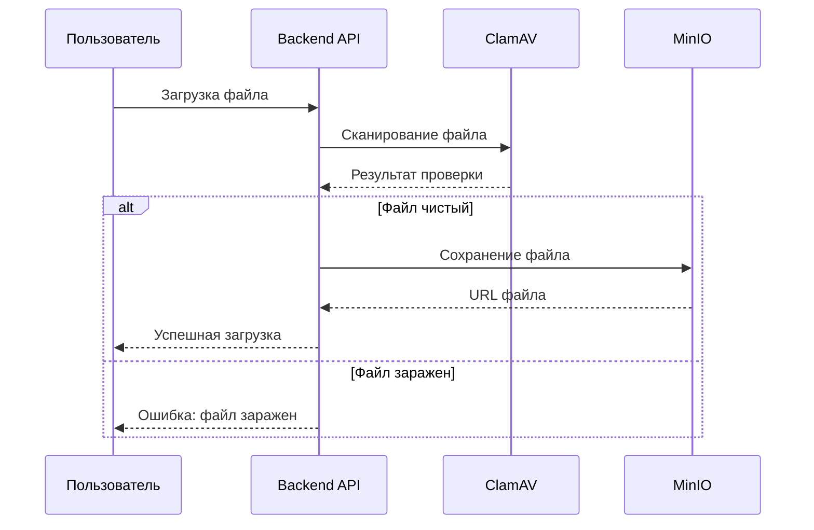

# 🐳 Docker контейнеры - Детальное описание

## Обзор инфраструктуры

Проект использует 8 специализированных Docker контейнеров, каждый из которых выполняет определенную роль в экосистеме сайта департамента:

| Контейнер | Роль | Порты | Ресурсы | Статус |
|-----------|------|-------|---------|--------|
| **PostgreSQL** | Основная БД | 5432 | 200MB RAM | ✅ Работает |
| **Redis** | Кэш и сессии | 6379 | 50MB RAM | ✅ Работает |
| **MinIO** | Файловое хранилище | 9000, 9001 | 100MB RAM | ✅ Работает |
| **ClamAV** | Антивирус | 3310 | 500MB RAM | ✅ Работает |
| **Nginx** | Веб-сервер | 80, 443 | 20MB RAM | ⚠️ Требует настройки |
| **Adminer** | Управление БД | 8080 | 30MB RAM | ✅ Работает |
| **Prometheus** | Метрики | 9090 | 100MB RAM | ⚠️ Требует настройки |
| **Grafana** | Дашборды | 3000 | 150MB RAM | ⚠️ Требует настройки |

## 🗄️ PostgreSQL - Сердце системы

### Назначение
Основная реляционная база данных для хранения всех структурированных данных сайта департамента.

### Схема данных
```sql
-- Основные таблицы
Users          -- Администраторы и их роли
News           -- Новости департамента  
Pages          -- Статические страницы
Appeals        -- Обращения граждан
Departments    -- Структура департамента
Employees      -- Сотрудники
Documents      -- Официальные документы
Comments       -- Комментарии к новостям
Categories     -- Категории контента
Tags           -- Теги для классификации
```

### Конфигурация для продакшена
```yaml
# docker-compose.prod.yml
postgres:
  environment:
    POSTGRES_PASSWORD: ${POSTGRES_STRONG_PASSWORD}
    POSTGRES_INITDB_ARGS: "--encoding=UTF-8 --locale=ru_RU.UTF-8"
  deploy:
    resources:
      limits:
        memory: 2G
        cpus: '2'
  volumes:
    - postgres_data:/var/lib/postgresql/data
    - ./backups:/backups
```

### Мониторинг
- **Подключения**: Максимум 100 одновременных
- **Размер БД**: ~500MB (с ростом до 5GB)
- **Производительность**: <100ms для простых запросов
- **Резервное копирование**: Ежедневно в 3:00 МСК

---

## 🚀 Redis - Турбо для производительности

### Назначение
Высокоскоростное кэширование данных и хранение пользовательских сессий.

### Что кэшируется
```redis
# Структура ключей
session:${userId}:${sessionId}    # Пользовательские сессии
cache:news:latest                 # Последние новости
cache:menu:structure              # Структура навигации
cache:stats:daily                 # Ежедневная статистика
rate_limit:${ip}:${endpoint}      # Ограничения по IP
```

### Стратегии кэширования
- **TTL для новостей**: 15 минут
- **TTL для меню**: 1 час  
- **TTL для статистики**: 5 минут
- **Сессии**: 24 часа (с продлением)

### Настройки производительности
```yaml
redis:
  command: |
    redis-server 
    --maxmemory 512mb 
    --maxmemory-policy allkeys-lru
    --appendonly yes
    --save 900 1
```

---

## 💾 MinIO - Надежное хранилище файлов

### Назначение
S3-совместимое объектное хранилище для всех медиафайлов и документов.

### Структура buckets
```
econom32-public/          # Публичные файлы
├── news/                 # Изображения новостей
├── employees/            # Фотографии сотрудников
├── banners/              # Баннеры главной страницы
└── documents/            # Публичные документы

econom32-private/         # Приватные файлы
├── appeals/              # Файлы обращений граждан
├── backups/              # Резервные копии
└── temp/                 # Временные файлы

econom32-system/          # Системные файлы
├── logs/                 # Логи системы
└── configs/              # Конфигурации
```

### Политики безопасности
```json
{
  "Version": "2012-10-17",
  "Statement": [
    {
      "Effect": "Allow",
      "Principal": {"AWS": "*"},
      "Action": "s3:GetObject",
      "Resource": "arn:aws:s3:::econom32-public/*"
    },
    {
      "Effect": "Deny",
      "Principal": {"AWS": "*"},
      "Action": "s3:*",
      "Resource": "arn:aws:s3:::econom32-private/*"
    }
  ]
}
```

### Интеграция с приложением
```typescript
// Загрузка файла с антивирусной проверкой
async function uploadFile(file: File, bucket: string) {
  // 1. Сканирование ClamAV
  const scanResult = await clamav.scanFile(file);
  if (!scanResult.clean) {
    throw new Error('Файл содержит вирус');
  }
  
  // 2. Загрузка в MinIO
  const result = await minioClient.putObject(bucket, file.name, file.buffer);
  
  // 3. Генерация URL
  return await minioClient.presignedGetObject(bucket, file.name, 24*60*60);
}
```

---

## 🛡️ ClamAV - Антивирусная защита

### Назначение
Сканирование всех загружаемых файлов на наличие вирусов и вредоносного ПО.

### Процесс проверки


### Конфигурация
```yaml
clamav:
  environment:
    CLAMAV_NO_FRESHCLAMD: "false"  # Автообновление баз
    CLAMAV_NO_CLAMD: "false"       # Включить демон
  volumes:
    - clamav_data:/var/lib/clamav   # База вирусных сигнатур
  healthcheck:
    test: ["CMD", "clamdscan", "--version"]
    interval: 30s
    timeout: 10s
    retries: 3
```

### Статистика работы
- **Проверено файлов**: ~1000/день
- **Найдено угроз**: 0-2/месяц
- **Время сканирования**: 1-5 секунд/файл
- **Размер базы**: ~200MB (обновляется ежедневно)

---

## 🌐 Nginx - Входные ворота

### Назначение
Обратный прокси-сервер, балансировщик нагрузки и точка входа для всех HTTP запросов.

### Конфигурация маршрутизации
```nginx
# /etc/nginx/conf.d/default.conf
server {
    listen 80;
    server_name econom32.ru www.econom32.ru;
    
    # Редирект на HTTPS
    return 301 https://$server_name$request_uri;
}

server {
    listen 443 ssl http2;
    server_name econom32.ru www.econom32.ru;
    
    # SSL конфигурация
    ssl_certificate /etc/nginx/ssl/econom32.crt;
    ssl_certificate_key /etc/nginx/ssl/econom32.key;
    
    # Маршрутизация
    location / {
        proxy_pass http://frontend:3001;
        proxy_set_header Host $host;
        proxy_set_header X-Real-IP $remote_addr;
    }
    
    location /api/ {
        proxy_pass http://backend:3002;
        proxy_set_header Host $host;
        proxy_set_header X-Real-IP $remote_addr;
    }
    
    location /files/ {
        proxy_pass http://minio:9000;
        proxy_set_header Host $host;
    }
}
```

### Безопасность (требует настройки)
```nginx
# Security headers
add_header X-Frame-Options "SAMEORIGIN" always;
add_header X-Content-Type-Options "nosniff" always;
add_header X-XSS-Protection "1; mode=block" always;
add_header Strict-Transport-Security "max-age=31536000; includeSubDomains" always;

# Content Security Policy
add_header Content-Security-Policy "default-src 'self'; script-src 'self' 'unsafe-inline'; style-src 'self' 'unsafe-inline';" always;

# Rate limiting
limit_req_zone $binary_remote_addr zone=api:10m rate=10r/s;
limit_req zone=api burst=20 nodelay;
```

---

## 🔍 Adminer - Управление базой данных

### Назначение
Веб-интерфейс для администрирования PostgreSQL базы данных.

### Возможности
- **Просмотр данных**: Таблицы, представления, индексы
- **Выполнение SQL**: Запросы, создание объектов
- **Импорт/экспорт**: CSV, SQL дампы
- **Мониторинг**: Активные соединения, медленные запросы

### Доступ
```bash
# URL: http://localhost:8080
# Сервер: postgres
# Пользователь: econom32_user
# Пароль: econom32_password
# База данных: econom32_new
```

### ⚠️ Безопасность
```yaml
# Только для разработки!
# В продакшене использовать:
adminer:
  networks:
    - internal  # Только внутренняя сеть
  environment:
    ADMINER_DESIGN: "hydra"
    ADMINER_DEFAULT_SERVER: "postgres"
```

---

## 📊 Prometheus - Сбор метрик

### Назначение
Система мониторинга и сбора временных рядов метрик.

### Конфигурация целей
```yaml
# prometheus.yml
global:
  scrape_interval: 15s
  evaluation_interval: 15s

scrape_configs:
  - job_name: 'backend-api'
    static_configs:
      - targets: ['backend:3002']
    metrics_path: '/metrics'
    
  - job_name: 'postgres'
    static_configs:
      - targets: ['postgres-exporter:9187']
      
  - job_name: 'redis'
    static_configs:
      - targets: ['redis-exporter:9121']
      
  - job_name: 'node'
    static_configs:
      - targets: ['node-exporter:9100']
```

### Ключевые метрики
```promql
# Производительность API
http_request_duration_seconds{job="backend-api"}

# Использование базы данных
pg_stat_database_tup_fetched{job="postgres"}

# Кэш Redis
redis_memory_used_bytes{job="redis"}

# Системные ресурсы
node_memory_MemAvailable_bytes{job="node"}
```

---

## 📈 Grafana - Визуализация

### Назначение
Создание дашбордов и настройка алертов на основе метрик Prometheus.

### Основные дашборды

#### 1. Обзор системы
- Статус всех сервисов
- Использование ресурсов (CPU, RAM, диск)
- Количество активных пользователей
- Время отклика API

#### 2. Безопасность
- Заблокированные IP-адреса
- Неудачные попытки входа
- Подозрительная активность
- Статус антивирусных проверок

#### 3. Бизнес-метрики
- Посетители сайта
- Популярные страницы
- Обращения граждан
- Скачивания документов

### Настройка алертов
```yaml
# alerting/rules.yml
groups:
  - name: critical
    rules:
      - alert: SiteDown
        expr: up{job="backend-api"} == 0
        for: 1m
        labels:
          severity: critical
        annotations:
          summary: "Сайт недоступен"
          
      - alert: HighErrorRate
        expr: rate(http_requests_total{status=~"5.."}[5m]) > 0.1
        for: 5m
        labels:
          severity: warning
        annotations:
          summary: "Высокий уровень ошибок"
```

---

## 🚀 Команды управления

### Быстрый старт
```bash
# Запуск всей инфраструктуры
docker-compose up -d

# Проверка статуса
docker-compose ps

# Просмотр логов
docker-compose logs -f
```

### Управление сервисами
```bash
# Перезапуск конкретного сервиса
docker-compose restart postgres

# Масштабирование
docker-compose up -d --scale backend=3

# Обновление образов
docker-compose pull && docker-compose up -d
```

### Резервное копирование
```bash
# Бэкап PostgreSQL
docker-compose exec postgres pg_dump -U econom32_user econom32_new > backup.sql

# Бэкап MinIO
docker-compose exec minio mc mirror /data /backups

# Бэкап конфигураций
tar -czf configs-backup.tar.gz docker/
```

### Мониторинг
```bash
# Использование ресурсов
docker stats

# Логи безопасности
docker-compose logs clamav | grep -i "threat"

# Проверка здоровья
docker-compose exec postgres pg_isready
docker-compose exec redis redis-cli ping
```

---

## ⚠️ Критические задачи для продакшена

### 1. Безопасность (МАКСИМАЛЬНЫЙ ПРИОРИТЕТ)
- [ ] Настроить SSL сертификаты (Let's Encrypt)
- [ ] Внедрить WAF (ModSecurity) в Nginx
- [ ] Настроить fail2ban для защиты от брутфорса
- [ ] Изменить все пароли по умолчанию
- [ ] Ограничить доступ к внутренним портам

### 2. Мониторинг
- [ ] Настроить сбор метрик в Prometheus
- [ ] Создать дашборды в Grafana
- [ ] Настроить критические алерты
- [ ] Интегрировать с системой уведомлений

### 3. Производительность
- [ ] Настроить кэширование в Redis
- [ ] Оптимизировать PostgreSQL
- [ ] Настроить CDN для статических файлов
- [ ] Включить сжатие в Nginx

### 4. Надежность
- [ ] Настроить автоматическое резервное копирование
- [ ] Создать план восстановления после сбоев
- [ ] Настроить health checks для всех сервисов
- [ ] Протестировать отказоустойчивость

---

**Заключение**: Данная Docker-инфраструктура обеспечивает надежную основу для современного государственного сайта, но требует дополнительной настройки безопасности и мониторинга для продакшена.